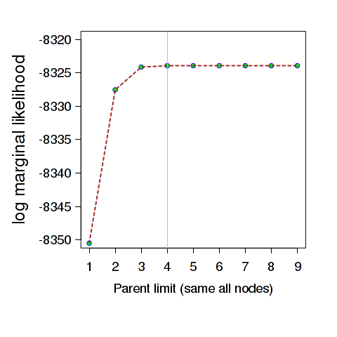
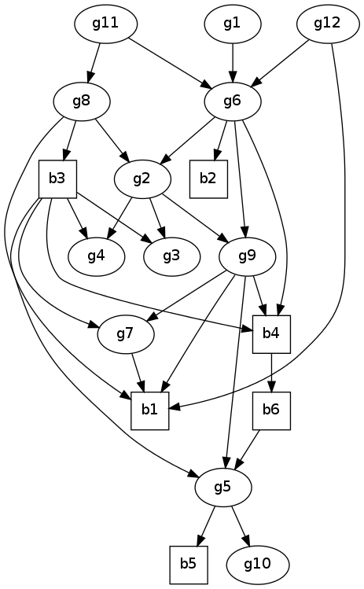
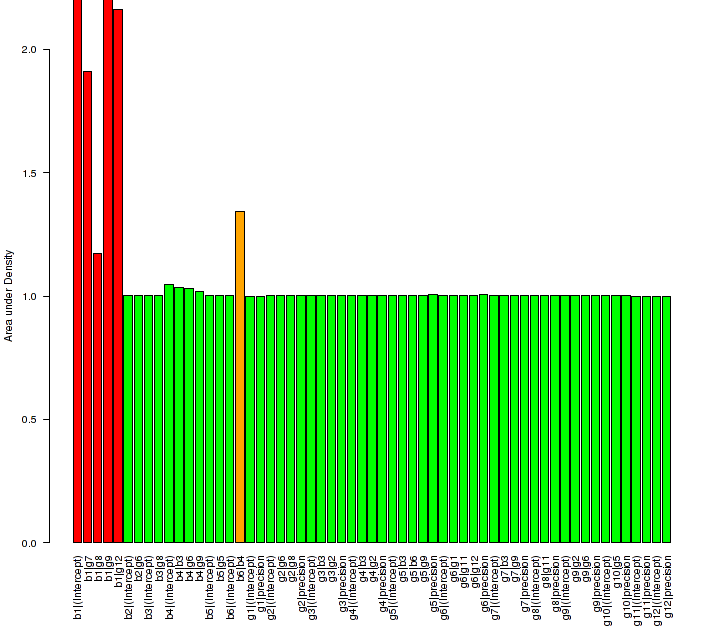

# Overview

This case study uses data set *ex5.dag.data* provided with [abn](https://CRAN.R-project.org/package=abn) which comprises of 434 observations across 18 variables, 6 binary and 12 continuous, and one grouping variable.

Variables b1 and b2 were formed by taking a variable with three categories and splitting it into two binary variables. To include such multinomial variables in [abn](https://CRAN.R-project.org/package=abn) one must first split these variables into separate binary variables, e.g. each denoting categories such as *{Yes, Not Yes}*, *{No, Not No}*, *{Dont Know, Not Dont Know}* etc. This is more flexible than usual nominal regression since other variables can now have completely different effects on each different category (as opposed to something like a proportional odds assumption). This does, however, have two consequences:
1. it can greatly add to the dimension of the model which can be a limiting factor
2. when performing any model selection we must ban any arcs from being considered between the split variables as these are not “real” dependencies but simply structural artifacts. This can be easily achieved through giving a ban matrix to the relevant functions (see below).

This data has a grouping variable. This means that the observations within each group (e.g. household or farm) may be correlated, and therefore potentially causing the distribution of the data for any particular covariate pattern to be over-dispersed relative to standard sampling distributions (e.g. binomial or Gaussian sampling). The usual way to deal with this would be to move from using generalised linear models at each node to generalised linear mixed models at each node. As yet, such functionality is not available within [abn](https://CRAN.R-project.org/package=abn) (it is for binary nodes but this is still largely experimental and nothing is implemented for correlated data at Gaussian nodes). There is a relatively straightforward workaround – we simply ignore the grouping effects during the model searching and then apply an appropriate adjustment to the final chosen model, where this may result in trimming some arcs from the model. This adjustment is to correct for the fact that our model may not be sufficiently conservative as the usual impact of ignoring correlation effects is an under-estimation of variance. Therefore, resulting in potential over-modelling – our model may have more structure (arcs) than could reasonably be supported given the available data. There is some argument that this “post-correction” approach may in fact be a better solution, as dealing directly with DAGs comprising of mixed models is vastly more computationally demanding, and the numerics involved are always far more approximate than when random effects are not involved. This correction will be performed using MCMC in JAGS/WinBUGS (see later).

# Deciding on a search method

As a very rough rule of thumb if there are less than 20 variables (and no random effects) then probably the most robust model search option is an exact search (as opposed to a heuristic) which will identify a globally best DAG. Followed then by parametric bootstrapping in order to assess whether the identified model contains excess structure (this is an adjustment for over-modelling). Although, the parametric bootstrapping might require access to a cluster computer to make this computationally feasible. This is arguably one of the most comprehensive and reliable statistical modelling approaches for identifying an empirically justified best guess (DAG) at “nature’s true model” – the unknown mechanisms and processes which generated the study data.

# Preparing the data

There are two main things which need to be checked in the data before it can be used with any of the [abn](https://CRAN.R-project.org/package=abn) model fitting functions.

1. All records with missing variables must be either removed or imputed. There is a range of libraries available from CRAN for completing missing values using approaches such as multiple imputation. Ideally, marginalising over the missing values is preferable (as opposed completing them as this then results in essentially dealing with models of models), but this is far from trivial here and not yet (and may never be) implemented in [abn](https://CRAN.R-project.org/package=abn). To remove all records with one or more missing values then code similar to the following probably suffices
*ex5.dag.data[complete.cases(ex5.dag.data),]*

2. All variables which are to be treated as binary must be coerced to factors. To coerce an existing variable into a factor then
*ex5.dag.data[,1]<-as.factor(ex5.dag.data[,1])* coerces the first variable in data.frame *ex5.dag.data*. The levels (labels of the factor) can be anything provided there are only two and a *success* here is take to be the second level. For example, the second value in the vector returned by
*levels(ex5.dag.data[,1])*

To include additional variables in the modeling, for example interaction terms or polynomials, then these must be created manually and included into the data.frame just like any other variable.

# Initial searches for a optimal model

Below is some R code which will perform an exact search using a parent limit of at most one parent per node. Similar code can be used to perform searches for higher parent limits (similar code can be downloaded from a link further down this page).

```r
library(abn)
mydat <- ex5.dag.data[,-19] ## get the data - drop group variable 
```

Create a matrix of banned arcs. Row are children, columns parents. The first row says do not allow arc b1<-b2. Second row is similar and says do not allow b2<-b1. These banned arcs are for the split variables. The ban matrix must be a named matrix.

```r
banned<-matrix(c(
# 1 2 3 4 5 6 7 8 9 0 1 2 3 4 5 6 7 8
0,1,0,0,0,0,0,0,0,0,0,0,0,0,0,0,0,0, # b1
1,0,0,0,0,0,0,0,0,0,0,0,0,0,0,0,0,0, # b2
0,0,0,0,0,0,0,0,0,0,0,0,0,0,0,0,0,0, # b3
0,0,0,0,0,0,0,0,0,0,0,0,0,0,0,0,0,0, # b4
0,0,0,0,0,0,0,0,0,0,0,0,0,0,0,0,0,0, # b5
0,0,0,0,0,0,0,0,0,0,0,0,0,0,0,0,0,0, # b6
0,0,0,0,0,0,0,0,0,0,0,0,0,0,0,0,0,0, # g1
0,0,0,0,0,0,0,0,0,0,0,0,0,0,0,0,0,0, # g2
0,0,0,0,0,0,0,0,0,0,0,0,0,0,0,0,0,0, # g3
0,0,0,0,0,0,0,0,0,0,0,0,0,0,0,0,0,0, # g4
0,0,0,0,0,0,0,0,0,0,0,0,0,0,0,0,0,0, # g5
0,0,0,0,0,0,0,0,0,0,0,0,0,0,0,0,0,0, # g6
0,0,0,0,0,0,0,0,0,0,0,0,0,0,0,0,0,0, # g7
0,0,0,0,0,0,0,0,0,0,0,0,0,0,0,0,0,0, # g8
0,0,0,0,0,0,0,0,0,0,0,0,0,0,0,0,0,0, # g9
0,0,0,0,0,0,0,0,0,0,0,0,0,0,0,0,0,0, # g10
0,0,0,0,0,0,0,0,0,0,0,0,0,0,0,0,0,0, # g11
0,0,0,0,0,0,0,0,0,0,0,0,0,0,0,0,0,0 # g12
),byrow=TRUE,ncol=18)

colnames(banned)<-rownames(banned)<-names(mydat);
```

The retain matrix is not constrained i.e a zero matrix (one could also use *NULL*).

```r
retain<-matrix(c(
# 1 2 3 4 5 6 7 8 9 0 1 2 3 4 5 6 7 8
0,0,0,0,0,0,0,0,0,0,0,0,0,0,0,0,0,0, # b1
0,0,0,0,0,0,0,0,0,0,0,0,0,0,0,0,0,0, # b2
0,0,0,0,0,0,0,0,0,0,0,0,0,0,0,0,0,0, # b3
0,0,0,0,0,0,0,0,0,0,0,0,0,0,0,0,0,0, # b4
0,0,0,0,0,0,0,0,0,0,0,0,0,0,0,0,0,0, # b5
0,0,0,0,0,0,0,0,0,0,0,0,0,0,0,0,0,0, # b6
0,0,0,0,0,0,0,0,0,0,0,0,0,0,0,0,0,0, # g1
0,0,0,0,0,0,0,0,0,0,0,0,0,0,0,0,0,0, # g2
0,0,0,0,0,0,0,0,0,0,0,0,0,0,0,0,0,0, # g3
0,0,0,0,0,0,0,0,0,0,0,0,0,0,0,0,0,0, # g4
0,0,0,0,0,0,0,0,0,0,0,0,0,0,0,0,0,0, # g5
0,0,0,0,0,0,0,0,0,0,0,0,0,0,0,0,0,0, # g6
0,0,0,0,0,0,0,0,0,0,0,0,0,0,0,0,0,0, # g7
0,0,0,0,0,0,0,0,0,0,0,0,0,0,0,0,0,0, # g8
0,0,0,0,0,0,0,0,0,0,0,0,0,0,0,0,0,0, # g9
0,0,0,0,0,0,0,0,0,0,0,0,0,0,0,0,0,0, # g10
0,0,0,0,0,0,0,0,0,0,0,0,0,0,0,0,0,0, # g11
0,0,0,0,0,0,0,0,0,0,0,0,0,0,0,0,0,0 # g12
),byrow=TRUE,ncol=18)
## again must set names
colnames(retain)<-rownames(retain)<-names(mydat)
```

Set up distribution list for each node

```r
mydists<-list(b1="binomial",
b2="binomial",
b3="binomial",
b4="binomial",
b5="binomial",
b6="binomial",
g1="gaussian",
g2="gaussian",
g3="gaussian",
g4="gaussian",
g5="gaussian",
g6="gaussian",
g7="gaussian",
g8="gaussian",
g9="gaussian",
g10="gaussian",
g11="gaussian",
g12="gaussian"
)
```

Build a cache of all the local computations and perform an exact search.

```r
mycache.1par <- buildscorecache(data.df=mydat,data.dists=mydists, max.parents=1,centre=TRUE)

mp.dag <- mostprobable(score.cache=mycache.1par)
```

We want to find the DAG with the best goodness of fit (network score - log marginal likelihood) and ideally we would search for this without any a priori complexity limit (max number of parents). However, this may be both not computationally feasible and also highly inefficient. For example, with 434 observation is it really realistic to consider models with up to 17 covariates per node? One heuristic approach is to start off with an a priori limit of one parent per node, find the best DAG, and then repeat an identical search process (again using functions *buildscorecache()* and *mostprobable()*) with an increasing parent limit. Then stopping when the network score reach a plateau.

These initial searches can be parallelised, although whether this is worth the extra hassle depends on how many variables are present and what computing facilities are available. The run time for the *mostprobable()* function increases very considerably with the number of parents. The abn library does not include any implicit parallelisation. While it lacks the conceptual elegance of multi-threading, simply task farming jobs on separate cpus using R CMD BATCH is by far the most computationally efficient solution here. This can also easily be achieved on a cluster via an MPI C wrapper (e.g. run many parallel R CMD BATCH jobs). Many systems use MPI and as such some standard code can be used here (but there is usually a local submission script required for the scheduling engine).

Sample code which can be used on a cluster to parallelise searches for parent limits 2 through 9 can be found [here](https://gilleskratzer.github.io/ABN/material/Rcode/search_code.tar.gz). This comprises of 8 R scripts plus an MPI C wrapper (which needs to be compiled on the cluster using an appropriate compiler like mpicc). The compiled wrapper is the program actually submitted to the cluster. I used 8 different parent limits here as the cluster I use is built from compute nodes of 8 cores each and so it makes most sense to run parallel tasks in multiples of 8. I could have ran parent limits 1 through 16 but this is likely wasteful since I don’t expect the data to support so many parents.

### Results

Searches across parent limits 1 through 9 were run and we now examine the results. What we are looking for is simply the model with the best score (the largest – least negative – mlik value), checking that this does not improve when more parents are permitted. This then says we have found a DAG with maximal goodness of fit. What we find (below) is that the goodness of fit does not improve when we increase the parent limit beyond 4.



The actual DAG corresponding to the mlik = -8323.9393




# Adjustment for overfitting – parametric bootstrapping using MCMC

We have identified a DAG which has the best (maximum) possible goodness of fit according to the log marginal likelihood. This is the standard goodness of fit metric in Bayesian modelling (see [MacKay (1992)](https://www.mitpressjournals.org/doi/abs/10.1162/neco.1992.4.5.720)) and includes an implicit penalty for model complexity. While it is sometimes not always apparent from the technical literature, the log marginal likelihood can easily (and sometimes vastly) overfit with smaller data sets. Of course the difficulty is identifying what constitutes *small* here. In other words using the log marginal likelihood alone (or indeed any of the other usual metrics such as AIC or BIC) is likely to identify structural features, which, if the experiment/study was repeated many times, would likely only be recovered in a tiny faction of instances. Therefore, these features could not be considered robust. Overfitting is an ever present issue in model selection procedures, particular is common approaches such as stepwise regression searches (see [Babyak (2004)](https://www.cs.vu.nl/~eliens/sg/local/theory/overfitting.pdf)).

A well established approach for addressing overfitting is to use parametric bootstrapping (see [Friedman (1999)](http://scholar.google.com/scholar_url?hl=en&q=http://w3.cs.huji.ac.il/~nir/Papers/FGW2.pdf&sa=X&scisig=AAGBfm3-UgXALoAdzzXG_hPQAzhuMvYaiQ&oi=scholarr)). The basic idea is very simple. We take our chosen model and then simulate data sets from this, the same size as the original observed data, and see how often the different structural features are recovered. For example, is it reasonable for our data set of 434 observations to support a complexity of 29 arcs? Parametric bootstrapping is arguably one of the most defensible solutions for addressing overfitting, although it is likely the most computationally demanding, as for each simulated (bootstrap) data set we need to repeat the same exact model search as used with the original data. And we may need to repeat this analysis hundreds (or more) times to get robust results.

Performing parametric bootstrapping is easy enough to code up if done in small manageable chunks. Here we provide a step-by-step guide along with necessary sample code.

### Preliminaries – software needed

We have selected a DAG model and installed MCMC software such as [JAGS](http://mcmc-jags.sourceforge.net/) and WinBUGS are designed for simulating from exactly such models. So all we need to do is to implement the model, in the appropriate JAGS/WinBUGS syntax (which are very similar). Here I am going to use JAGS in preference to WinBUGS or OpenBUGS for no other reason than that is what I am most familiar with.

To implement the selected DAG in JAGS we need write a model definition file (a BUG file) which contains the structure of the dependencies in the model. We also need to provide in here the probability distributions for each and every parameter in the model. Note that in Bayesian modelling the parameter estimates will not generally conform to any standard probability distribution (e.g. Gaussian) unless we are in the very special case of having conjugate priors. The marginal parameter distributions required can be estimated using the *fitabn()* function and then fed into the model definition. We next demonstrate one way of doing this which is to use empirical distributions – in effect we provide JAGS with a discrete distribution over a fine grid which approximates whatever shape of density we need to sample from.

### Generating marginal densities

The function *fitabn()* has functionality to estimate the marginal posterior density for each parameter in the model. The parameters can be estimated one at a time by manually giving a grid (e.g. the x values where we want to evaluate f(x)) or else all together. In the latter case a very simple algorithm will try and work out where to estimate the density. This can work better sometimes and others, although it seems to work fine here for most variables. In order to use these distributions with JAGS we must evaluate the density over an equally spaced grid as otherwise the approach used in JAGS will not sample correctly. The basic command needed here is to estimate marginals, and use an equal grid of 1000 points:

```r
marg.f <- fitabn(dag.m=mydag,data.df=mydat,data.dists=mydists, compute.fixed=TRUE,n.grid=1000)
```

All the code in this section (there is quite a bit in total) is provided for download (later).

We should not simply assume that the marginals have been estimated accurately, and they should each be checked using some common sense. Generally speaking, estimating the goodness of fit (mlik) for a DAG comprising of GLM nodes is very reliable. This marginalises out all parameters in the model. Estimating marginal posterior densities for individual parameters, however, can run into trouble as this presupposes that the data contains sufficient information to accurately estimate the "shape" (density) for every individual parameter in the model. This is a stronger requirement than simply being able to estimate an overall goodness of fit metric. If a relatively large number of arcs have been chosen for a node with relatively few observations (i.e. "successes" in a binary node) then this may not be possible, or at least the results are likely to be suspect. Exactly such issues - overfitting - are why we are performing the parametric bootstrapping in the first place but they can also pose some difficulties before getting to this stage.

It is essential to first visually check the marginal densities estimated from *fitabn()*. Something like the following code will create a single pdf file where each page is a separate plot of a marginal posterior density:

```r
### update 22/02/2014.
## NOTE: this code only works in the version 0.83+ please use this latest version
library(Cairo)
CairoPDF("margplots.pdf")
for(i in 1:length(marg.f$marginals)){
cat("processing marginals for node:",nom1<-names(marg.f$marginals)[i],"\n") 
cur.node <- marg.f$marginals[i] ## get marginal for current node - this is a matrix [x,f(x)] cur.node <- cur.node[[1]] # this is always [[1]] for models without random effects 

for(j in 1:length(cur.node)){ 
cat("processing parameter:",nom2 <- names(cur.node)[j],"\n") 
cur.param <- cur.node[[j]]
plot(cur.param,type="l",main=paste(nom1,":",nom2))} 
}

dev.off()
```

These [plots](https://gilleskratzer.github.io/ABN/material/Plot/margplots.pdf) suggests that the first node, b1, has not been estimated very well - e.g. usually the densities should drop to zero at each endpoint which they do not for some of the parameters in b1. The rest of the densities look sensible enough. In case it is just that the built-in choice of x that has not worked well here we manually re-compute each of the odd looking marginals in node b1 to see if that improves the plots:

```r

## node b1 looks odd so re-do with manually chosen intervals
## (trial and error end points)
marg.b1.1 <- fitabn(dag.m=mydag,data.df=mydat,data.dists=mydists, compute.fixed=TRUE,marginal.node=1,marginal.param=1, variate.vec=seq(-150,5,len=1000))

```

Moreover, an additional implementation is needed to create the marginal densities in a suitable format for abn:

```r
### update 05/02/2016
marnew <- marg.f$marginals[[1]] for(i in 2: length(marg.f$marginals)){ 
marnew <- c(marnew, marg.f$marginals[[i]])}
```

The variable *marnew* should replace the *marg.f$marginals*, from the computation of the area, present in the full [code](https://gilleskratzer.github.io/ABN/material/Rcode/get_marginals_n18.R). There are four parameters which need manual intervention (parameter 2 in node b1 seems fine). The new refined [plots](https://gilleskratzer.github.io/ABN/material/Plot/margplots2.pdf) look better. We can now perform an additional common sense check on their reliability. A probability density must integrate to unity (the area under the curve is equal to one). The densities here are estimated numerically and so we would not expect to get exactly one (n.b. no internal standarization is done so we can check this), but if the numerical estimation has worked reliably then we would expect this to be close (e.g. 0.99, 1.01) to one.




From Fig.3 it is obvious that something is wrong with the parameters of node b1 as they are nowhere close to one (n.b their estimation is interdependent on each other since they are all from the same node). In the full code listing this is investigated in some detail by comparing results with R's glm() and also INLA. In short, the marginal parameters for this node cannot be estimated with any accuracy as the node is simply over-parameterised. Looking at the raw data the answer is obvious - variable b1 comprises of 432 "failures" and 2 "successes"! Yet, the exact model selection algorithm choose this node to have 4 covariates (excl. intercept). An excellent example of overfitting. No similar problems are apparent with any other node. So what do we do with node b1? The simplest option is to drop this variable from the analyses. In truth it would probably not have mattered too much if we kept it in and used the marginal densities as is in the bootstrapping - even though very poorly estimated (the area is not a problem as JAGS standardises this itself) - as these arcs would either all be dropped as a result of the parametric bootstrapping, or else some of them dropped and the remainder having such a large confidence intervals (wide posterior) that it not possible to really say anything about their effect. Dropping the variable b1 is the simpler option here which is what we now do.

There is one other parameter - in orange in Fig.3 - node b6 and covariate b4 which requires further investigation. The density looks ok but the area is a little adrift from one. The full code listing does some additional checking and the intercept for this node is estimated very accurately, which suggests that this parameter estimate is probably fine. The difference from one for the area just likely reflects the numerical accuracy error due to the massively wide posterior density (e.g. vanishing small floating point values involved), and so this seems of little concern. The reason for this "difficulty" can again be seen by simply looking at the data - a 2x2 table of b6 and b4 has a zero in it which is the cause of the massive uncertainty in the estimate for parameter b4. In summary, this parameter seems fine for including in the bootstrapping.

Finally, given that we are dropping node b1 we must then repeat all the exact searches. We now find that we only need a maximum of 3 parents.