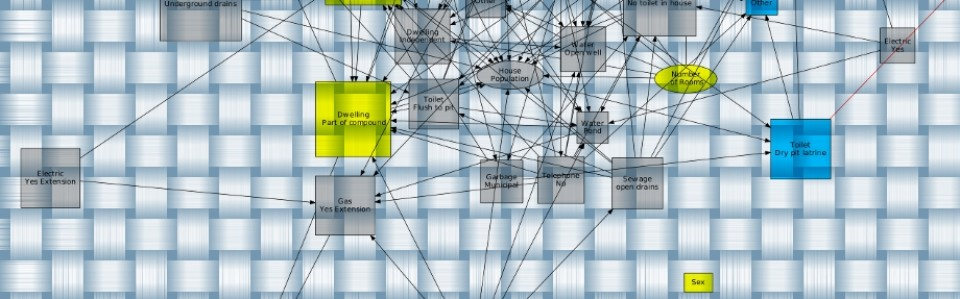

[](https://cran.rstudio.com/web/packages/abn/index.html) [](http://www.r-pkg.org/badges/version-last-release/abn/index.html)

# Introduction

Bayesian network modelling is a data analysis technique which is ideally suited to messy, highly correlated and complex datasets. This methodology is rather distinct from other forms of statistical modelling in that its focus is on **structure discovery** – determining an optimal graphical model which describes the inter-relationships in the underlying processes which generated the data. It is a **multivariate** technique and can used for one or many dependent variables. This is a data driven approach, as opposed to, rely only on subjective expert opinion to determine how variables of interest are inter-related (for example: structural equation modelling). An example can be found in the [American Journal of Epidemiology](http://aje.oxfordjournals.org/content/176/11/1051.abstract) where this approach was used to investigate risk factors for child diarrhoea. A special issue of [Preventive Veterinary Medicine](http://www.sciencedirect.com/science/journal/01675877/110/1) on graphical modelling features a number of articles which use [abn](https://CRAN.R-project.org/package=abn) to fit epidemiological data. An introduction to this methodology can be found in [Emerging Themes in Epidemiology](http://www.ete-online.com/content/10/1/4).

This website provides some [cookbook](#quickstart) type examples of how to perform Bayesian network **structure discovery** analyses with observational data. The particular type of Bayesian network models considered here are **additive Bayesian networks**. These are rather different, mathematically speaking, from the standard form of Bayesian network models (for binary or categorical data) presented in the academic literature, which typically use an analytically elegant, but arguably interpretation-wise opaque, contingency table parametrization. An additive Bayesian network model is simply a **multidimensional regression model**, e.g. directly analogous to generalised linear modelling but with all variables potentially dependent. All examples presented use an extension library for [R](http://www.r-project.org/) called [abn](https://CRAN.R-project.org/package=abn).

Contact [abn](https://CRAN.R-project.org/package=abn) package maintainer by email: `gilles.kratzer at math.uzh.ch`

*Contributors:*
*[Gilles Kratzer](https://gilleskratzer.netlify.com/), Marta Pittavino, Fraser Lewis and [Reinhard Furrer](https://user.math.uzh.ch/furrer/)*

***

# Installation

[abn](https://CRAN.R-project.org/package=abn) R package can easily be installed from [CRAN](https://CRAN.R-project.org/package=abn) using:

```r
install.packages("abn", dependencies = TRUE)
```

However further [libraries](getting_started.md) could be necessary to best profit from the [abn](https://CRAN.R-project.org/package=abn) features.

***

# Quickstart

[Simple examples](quickstart_examples.md) provide illustrations of how to perform data analyses using additive Bayesian networks with [abn](https://CRAN.R-project.org/package=abn) ( [installation procedure](getting_started.md)). The data sets used are provided with abn. Many more examples are given at the end of the relevant manual pages in R, e.g. see `?fitabn`, `?buildscorecache`, `?mostprobable`, `?search.hillclimber`. More realistic examples are given in [case studies](#case_studies).

***

# Literature

**General note**

Typical BN models involving binary nodes, arguably the most commonly used type of BN, use a contingency table rather than additive parameter formulation. This facilities mathematical elegance and means that key metrics like model goodness of fit and marginal posterior parameters can be estimated analytically (e.g. from a formula) rather than numerically (an approximation). The downside being that this parametrisation is likely far from parsimonious, and the interpretation of the model parameters is less clear than the usual GLM type models (which are common across all areas of science). This is, while practically important, a fairly low level technical distinction as the key aspect of BN modelling is that this is a form of graphical modelling – that is a model of the joint probability distribution of the data. It is this joint – multidimensional – aspect which makes this methodology so attractive for analyses of complex data and what discriminates it from the more standard regression techniques, e.g. glm’s, glmm’s etc, which are only one dimensional in that the covariates are all assumed independent. The latter is entirely reasonable in a classical experimental design scenario, but completely unrealistic for many observational studies in medicine, veterinary science, ecology and biology.

***

### Technical articles

- Kratzer et al. (2018): [Comparison between Suitable Priors for Additive Bayesian Networks](https://arxiv.org/pdf/1809.06636)
- Koivisto et al. (2004): [Exact Bayesian structure discovery in Bayesian networks](https://static.aminer.org/pdf/PDF/000/984/996/exact_bayesian_structure_discovery_in_bayesian_networks.pdf)
- Friedman et al. (2003): [Being Bayesian about network structure. A Bayesian approach to structure discovery in Bayesian networks](http://web.cs.iastate.edu/~jtian/cs673/cs673_spring05/references/Friedman-Koller-2003.pdf)
- Friedman et al. (1999): [Data analysis with Bayesian networks: A bootstrap approach](http://scholar.google.com/scholar_url?hl=en&q=http://w3.cs.huji.ac.il/~nir/Papers/FGW2.pdf&sa=X&scisig=AAGBfm3-UgXALoAdzzXG_hPQAzhuMvYaiQ&oi=scholarr)
- Heckerman et al. (1995): [Learning Bayesian Networks – The Combination of Knowledge And Statistical-Data](http://maxchickering.com/publications/ml95.pdf)

***

### Application articles

- Ruchti et al. (2018): [Pododermatitis in group housed rabbit does in Switzerland – prevalence, severity and risk factors](https://www.sciencedirect.com/science/article/pii/S0167587718300813?via%3Dihub)
- Pittavino et al. (2017): [Comparison between generalized linear modelling and additive Bayesian network; identification of factors associated with the incidence of antibodies against Leptospira interrogans sv Pomona in meat workers in New Zealand](https://www.sciencedirect.com/science/article/pii/S0001706X16308828?via%3Dihub)
- Hartnack et al. (2017): [Attitudes of Austrian veterinarians towards euthanasia in small animal practice: impacts of age and gender on views on euthanasia](http://download.springer.com/static/pdf/949/art%253A10.1186%252Fs12917-016-0649-0.pdf?originUrl=http%3A%2F%2Fbmcvetres.biomedcentral.com%2Farticle%2F10.1186%2Fs12917-016-0649-0&token2=exp=1455044551~acl=%2Fstatic%2Fpdf%2F949%2Fart%25253A10.1186%25252Fs12917-016-0649-0.pdf*~hmac=e04039a7400eefea35dc05635bccae1688e549b8b0eb36edc0b8fd72caba73fc)
- Lewis et al. (2012): [Revealing the Complexity of Health Determinants in Resource-poor Settings](http://aje.oxfordjournals.org/content/176/11/1051.full.pdf?keytype=ref&ijkey=zCJD2Zt88XaDYyY)
- Lewis et al. (2011): [Structure discovery in Bayesian networks: An analytical tool for analysing complex animal health data](http://pdn.sciencedirect.com/science?_ob=MiamiImageURL&_cid=271186&_user=4429&_pii=S0167587711000341&_check=y&_origin=browseVolIssue&_zone=rslt_list_item&_coverDate=2011-06-15&wchp=dGLbVlS-zSkWb&md5=29522e1462a0ac05fe07c787a4cd3d0a&pid=1-s2.0-S0167587711000341-main.pdf)

***

# Case studies

More case studies will be presented as additional features will be added in [abn](https://CRAN.R-project.org/package=abn). The general approach for **structure discovery** is broadly similar and relatively independent of the specific problem data. While Bayesian network modelling is computationally intensive, comparing across potentially large numbers of different models, it should **not** be treated as a black box approach as each individual data set has its own quirks and difficulties.

___

[Case Study One](case_study_one.md)

It gives a fairly typical and complete example for a data problem in which there are sufficiently few variables (around 20 or less) then an exact search is feasible, along with parametric bootstrapping to address overfitting. This uses real (anonymised), as opposed to artificially generated data and as such has some quirks. For example, due to small sample sizes some of the distributions cannot be reliably estimated and it may be sensible to drop one or more variables from the analyses. This example also includes a correction for grouped (correlated data) as a final step, for non-grouped data this step can be ignored.


***

# Further ressources

**Workshops**

- 
